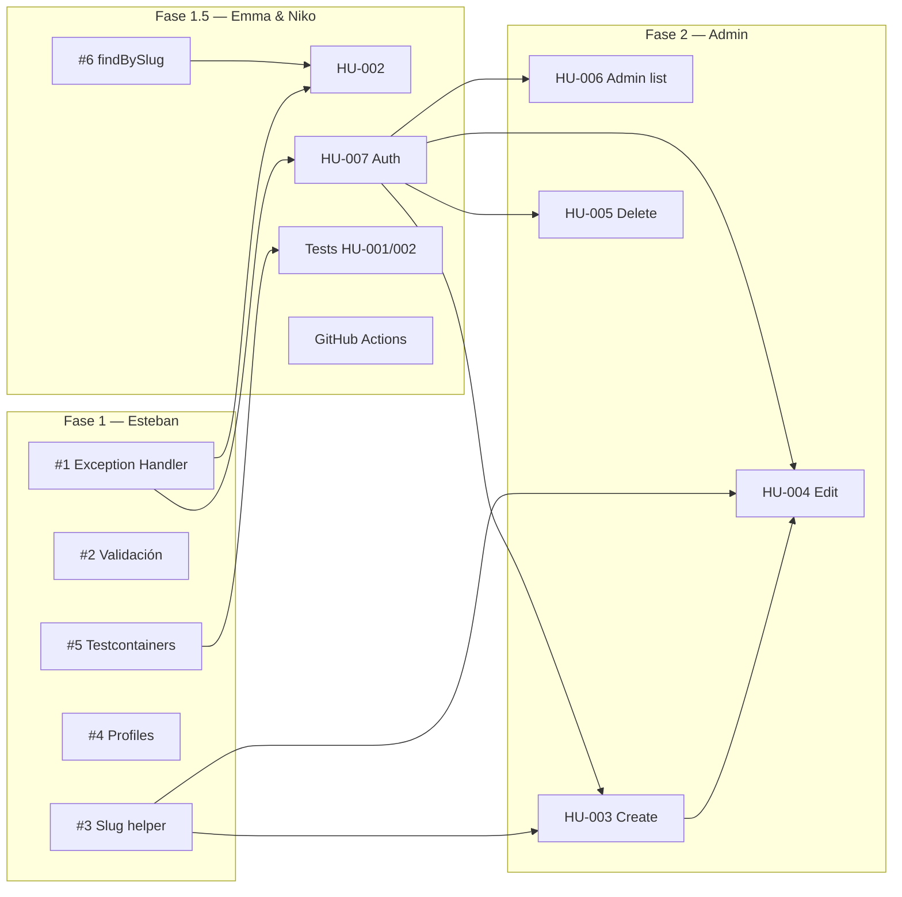

# 🏗️ Base Técnica — Plan de Trabajo

> Documento vivo para coordinar la base técnica del equipo.
> A medida que avanzen, chuleen (`[x]`) lo que está listo y actualicen notas.

## Objetivo

Pavimentar el proyecto para que todos puedan mandar código sin pisarse.
Esteban agarra la base, la aprende bien, la enseña, y después delega. Emma y Niko
arrancan con HUs chicas en paralelo ni bien haya camino.

---

## 📋 Tareas

### Fase 1 — Cimientos (Esteban)

Dependencia de todo lo demás. Sin esto, nadie puede avanzar tranquilo.

| # | Tarea | Estado | PR | Notas |
|---|-------|--------|----|-------|
| 1 | **Global Exception Handler** — `@RestControllerAdvice` con respuestas consistentes (`ErrorResponse` con timestamp, código, mensaje). Manejar 404, 400, 500, MethodArgumentNotValidException. | [ ] | — | — |
| 2 | **Validación en controllers** — Agregar `@Valid` a los endpoints existentes y futuros. Mensajes de error en español (o inglés, decidan). | [ ] | — | — |
| 3 | **Slug helper + unique index** — Generar slug desde el título. Índice único en MongoDB para evitar slugs duplicados. | [ ] | — | Lo van a necesitar HU-002, HU-003, HU-004 |
| 4 | **Spring Profiles** — Separar `dev` (local, docker-compose) de `prod` (MongoDB Atlas o similar). | [ ] | — | — |
| 5 | **Testcontainers + base test class** — Config para tests de integración con MongoDB real. Clase abstracta `BaseIntegrationTest` que levante el container. | [ ] | — | — |

Duración estimada: **2-3 días hábiles** si Esteban se mete de lleno.

### Fase 1.5 — Lo que Emma y Niko pueden ir haciendo mientras

No dependen de la Fase 1 completa, pueden arrancar en paralelo.

| # | Tarea | Responsable | Depende de | Estado | Notas |
|---|-------|-------------|------------|--------|-------|
| 6 | `findBySlug` en `ProjectRepository` | Emma | — | [ ] | Solo agregar el método, Esteban lo integra después |
| 7 | HU-002: `GET /api/projects/{slug}` | Emma | #6, #1 | [ ] | Endpoint público, necesita el Exception Handler listo |
| 8 | HU-007: Auth (API Key o JWT básico) | Niko | — | [ ] | Definir si va API Key simple o JWT. Admin endpoints la van a necesitar |
| 9 | Tests de integración para HU-001 y HU-002 | Emma | #5 | [ ] | Usar `BaseIntegrationTest` |
| 10 | Setup de GitHub Actions (build + test) | Niko | — | [ ] | Maven + Java 25, que corra tests en cada PR |

### Fase 2 — Admin endpoints (Emma / Niko / quien libere)

Una vez que auth y exception handler estén, estos caen solos.

| # | Tarea | Responsable | Depende de | Estado | Notas |
|---|-------|-------------|------------|--------|-------|
| 11 | HU-006: Admin listar todos los proyectos (publicados y borradores) | Emma | #8 | [ ] | `GET /api/admin/projects` |
| 12 | HU-003: Admin crear proyecto | Niko | #8, #1, #3 | [ ] | `POST /api/admin/projects` — acá `createProject()` deja de devolver null |
| 13 | HU-004: Admin editar proyecto | ? | #8, #3, #12 | [ ] | `PUT /api/admin/projects/{slug}` |
| 14 | HU-005: Admin eliminar proyecto | ? | #8, #12 | [ ] | `DELETE /api/admin/projects/{slug}` |

---

## 🧭 Dependencias visuales

---

## 📌 Decisiones del equipo

*Espacio para ir documentando las decisiones que tomen entre todos.*

| Fecha | Decisión | Quién | 
|-------|----------|-------|
| — | *Definir idioma de mensajes de error (es/en)* | 👥 Equipo |
| — | *API Key estática vs JWT para admin auth* | 👥 Equipo |
| — | *¿Swagger/OpenAPI?* | 👥 Equipo |
| — | *¿MongoDB Atlas o local en prod?* | 👥 Equipo |

---

## 🎓 Lo que Esteban va a aprender y enseñar

| Tema | Para qué sirve | Se lo enseña a |
|------|---------------|----------------|
| `@RestControllerAdvice` | Manejo centralizado de errores | Emma, Niko |
| MapStruct con Spring | Mapeo DTO ↔ Entity | Emma, Niko |
| Testcontainers | Tests de integración sin mockear la DB | Emma |
| Spring Profiles | Separar configs por entorno | Niko |
| Conventional Commits + Git Flow | Estandarizar el laburo | Emma, Niko |

---

## 🚀 Cómo arrancamos

1. **Hoy** — Repasan esto, lo ajustan, definen las decisiones pendientes.
2. **Esteban** — Arranca la Fase 1 en orden (`#1 → #2 → #3 → #4 → #5`).
3. **Emma** — Apenas Esteban termine `#1`, puede arrancar HU-002 tranquila.
4. **Niko** — Puede ir haciendo `#8` (auth) y `#10` (GitHub Actions) desde ya.
5. **Daily / cada 2 días** — Actualizan este MD, chulean lo que sale, ven qué sigue.

---

*Cuando una tarea está lista, el responsable abre el PR a `develop`, asigna un revisor, y cuando se mergea, chulea el checkbox.*
