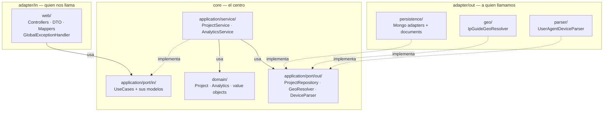

# 🧭 Arquitectura — Mapa del proyecto

> Guía para ubicarse en el código. Si venís de la estructura vieja
> (`controller/`, `service/`, `repository/`, `model/`), empezá por
> [¿Dónde quedó cada cosa?](#-dónde-quedó-cada-cosa).

## La única regla

**Las dependencias apuntan siempre hacia adentro.**

El dominio es el centro y no sabe que existen Spring, MongoDB ni HTTP. Todo lo demás
son adaptadores que se conectan a él a través de puertos (interfaces).



Fijate en las flechas punteadas: **todas las implementaciones apuntan hacia adentro**.
`ProjectMongoAdapter` implementa una interfaz de la que el core es dueño. Por eso podés
cambiar MongoDB por Postgres sin tocar una línea de `core/`.

---

## 📁 El árbol, anotado

```
com.estebangitpro.portfolio
│
├── core/                              ← nada acá sabe de Spring ni de HTTP
│   ├── domain/                        el anillo más interno
│   │   ├── Project · ProjectLinks · ProjectStatus
│   │   ├── StrategyItem · TechStackItem
│   │   └── Analytics · AnalyticsType
│   │
│   └── application/
│       ├── port/in/                   ← qué le podés pedir a la app
│       │   ├── ProjectQueryUseCase · ProjectCommandUseCase
│       │   ├── AnalyticsQueryUseCase · AnalyticsTrackUseCase
│       │   └── ProjectDraft · AnalyticsSummary   (modelos de entrada/salida)
│       │
│       ├── port/out/                  ← qué necesita la app del exterior
│       │   ├── ProjectRepository · AnalyticsRepository
│       │   └── GeoResolver · DeviceParser
│       │
│       ├── service/                   implementan los UseCase
│       │   └── ProjectService · AnalyticsService
│       │
│       └── exception/
│           └── ProjectNotFoundException
│
├── adapter/
│   ├── in/web/                        ← entra por acá
│   │   ├── ProjectPublicController · ProjectAdminController
│   │   ├── AnalyticsController · GlobalExceptionHandler
│   │   ├── dto/                       ProjectRequest · ProjectResponse
│   │   │                              AnalyticsResponse · AnalyticsTrackRequest
│   │   └── mapper/                    ProjectMapper · AnalyticsMapper (MapStruct)
│   │
│   └── out/                           ← sale por acá
│       ├── persistence/               Mongo adapters, documents, repos, índices
│       ├── geo/                       IpGuideGeoResolver
│       └── parser/                    UserAgentDeviceParser
│
└── config/                            composition root (CORS, Mongo, RestTemplate)
```

---

## 🔍 ¿Dónde quedó cada cosa?

| Estructura vieja | Dónde está ahora | Por qué |
|---|---|---|
| `controller/` | `adapter/in/web/` | Un controller es un adaptador de entrada por HTTP |
| `model/` | `core/domain/` | Entidades y value objects, sin anotaciones de Mongo |
| `service/` + `service/impl/` | `core/application/service/` | Sin sufijo `Impl`: el contrato es el puerto |
| `repository/` | **se partió en dos** — ver abajo | Tenía dos cosas de anillos distintos |
| `dto/` | `adapter/in/web/dto/` | Un DTO es una representación HTTP, no de dominio |
| `mapper/` | `adapter/in/web/mapper/` | La traducción DTO ↔ dominio es trabajo del adapter |
| `exception/` | **se partió en dos** — ver abajo | Ídem |
| `dataloader/` | eliminado | Insertaba un proyecto duplicado en cada arranque |

### `repository/` se partió en dos

Esto es lo que más confunde al principio. Eran dos cosas distintas con nombres parecidos:

```java
// core/application/port/out/ProjectRepository.java  ← EL PUERTO
public interface ProjectRepository {
    Optional<Project> findById(String id);      // habla Project, tipo de dominio
    Project save(Project project);
}
// cero imports de Spring. Solo dice "necesito guardar y buscar proyectos".
```

```java
// adapter/out/persistence/ProjectMongoRepository.java  ← EL DETALLE TÉCNICO
public interface ProjectMongoRepository extends MongoRepository<ProjectMongoDocument, String> {
    List<ProjectMongoDocument> findByPublishedTrueOrderByOrderAsc();
}
// Spring Data puro. Habla ProjectMongoDocument, no Project.
```

En el medio está `ProjectMongoAdapter`, que implementa el primero usando el segundo y
traduce entre `Project` y `ProjectMongoDocument`.

### `exception/` se partió en dos

| Clase | Dónde | Por qué |
|---|---|---|
| `ProjectNotFoundException` | `core/application/exception/` | Es el resultado de un lookup vacío |
| `GlobalExceptionHandler` | `adapter/in/web/` | Es `@RestControllerAdvice`: puro HTTP |

El core dice **qué pasó**; el adaptador decide **cómo comunicarlo**. Si mañana agregamos
un CLI, la misma excepción se traduce a un mensaje de consola sin tocar el core.

---

## 🔄 Flujo de un request

`POST /api/admin/projects`:

```
1. ProjectAdminController.createProject(@Valid ProjectRequest)   adapter/in/web
        ↓
2. ProjectMapper.toDraft(request)                                DTO → dominio
        ↓
3. ProjectCommandUseCase.createProject(draft)                    port/in  (interfaz)
        ↓
4. ProjectService.createProject(draft)                           application/service
   ├── generateSlug(title)                                       regla de negocio
   └── repository.save(project)                                  port/out (interfaz)
        ↓
5. ProjectMongoAdapter.save(project)                             adapter/out/persistence
   ├── toDocument(project)                                       dominio → Mongo
   └── mongoRepository.save(doc)
        ↓
6. ProjectMapper.toResponse(saved)                               dominio → DTO
        ↓
7. HTTP 201 + JSON
```

Los pasos 3 y 4 están separados a propósito: el controller depende de la **interfaz**,
nunca de `ProjectService`. Spring inyecta la implementación.

---

## 🚦 Las reglas están automatizadas

`HexagonalArchitectureTest` (ArchUnit) valida 9 reglas en cada build. Si rompés una, el
build falla:

| Regla | Qué impide |
|---|---|
| Capas de la cebolla | Que un anillo interno dependa de uno externo |
| Dominio sin frameworks | Spring, Jakarta, MapStruct, MongoDB dentro de `domain/` |
| Dominio sin aplicación | Que `domain/` dependa de `application/` |
| Core sin adapters | Que `core/` conozca `adapter/` o `config/` |
| Entrada solo por `port/in` | Que un adapter de entrada toque `port/out` y saltee las reglas de negocio |
| Salida no llama casos de uso | Que un adapter de salida invoque `port/in` |
| Entrada no toca salida | Que el web adapter vaya directo a persistencia |
| Spring Data confinado | `org.springframework.data` fuera de `adapter/out/persistence` |
| Puertos son contratos | Clases concretas dentro de `port/` |

No son convenciones opcionales. Son tests.

---

## 💡 Cómo encontrar una clase

Después de la reestructura, buscar por carpeta ya no sirve. Buscá **por nombre**:

```bash
fd -e java 'ProjectRepository' src/main
rg -l 'class ProjectAdminController' src/main
```

En el IDE: `Cmd+O` (IntelliJ) o `Cmd+P` (VS Code) y escribís el nombre.

> Si el IDE muestra paquetes que ya no existen, es caché:
> **Maven → Reload Project** en IntelliJ.

---

## ✅ Antes de mandar un PR

- [ ] `./mvnw clean test` en verde (requiere Docker: los tests levantan Mongo con Testcontainers)
- [ ] No agregaste imports de Spring/Mongo dentro de `core/domain/`
- [ ] Los DTO nuevos viven en `adapter/in/web/dto/`, no en el core
- [ ] Si agregaste un puerto, quedó en `port/in` o `port/out` según quién lo llama

Convenciones de nombres y reglas obligatorias: [`04-estandares.md`](04-estandares.md).
